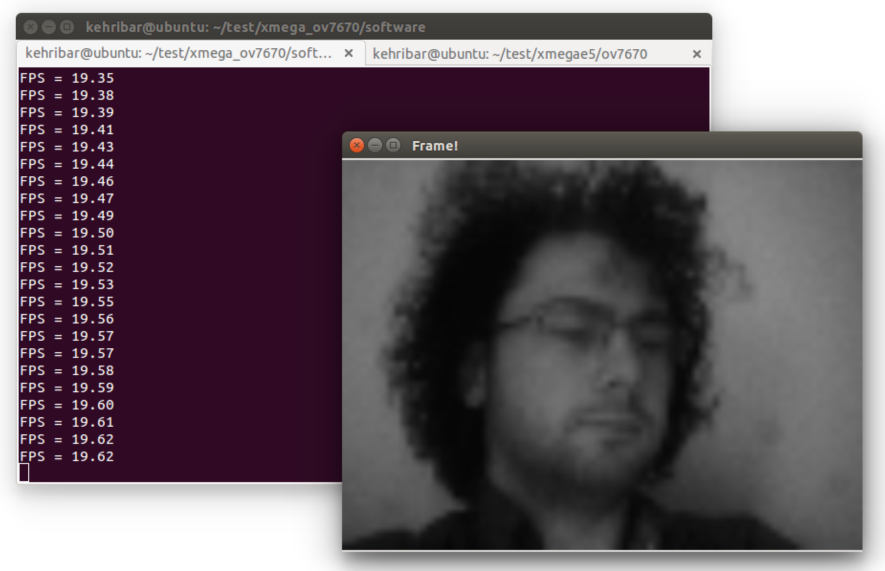
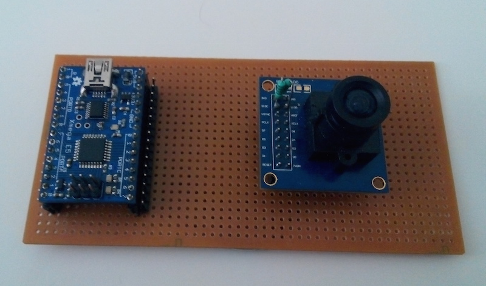
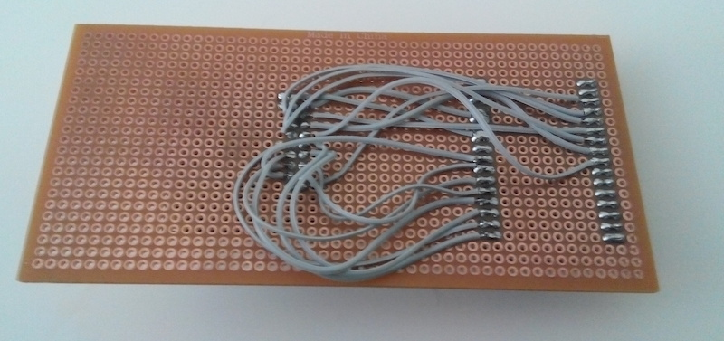

## OV7670 image sensor data capture with Atxmega32E5 without using external FIFO

- With current configuration, this system sends 20FPS 80x60 grayscale image data over 3Mbaud serial stream. There is 3 byte preamble {0xAA,0x55,0xAA} to indicate the start of a new image frame. Computer software / other MCU can use those bytes to sync with the data stream.

- Utilises two EDMA channels, two event channels, two timers and one UART peripheral of the XmegaE5 microcontroller.

- Computer software is written in C++ using OpenCV image drawing / matrix functions.

- This project is heavily inspired by "Interfacing a cheap phone camera module to a PIC32 microcontroller" project by @mikeselectricstuff. Video link of that project is: <http://www.youtube.com/watch?v=rQYByorpoFk> Watch that video to get a better understanding of this project. I basically ported his ideas to lower cost / lower feature set 8bit microcontroller.

### Video:

- Watch it from Vimeo: <https://vimeo.com/113537523>

### Sample capture:

### Board:

### Hardware connections:

	/------------------------------------------------------------------------------
	/ PORTD.7    => UART TX (UART is configured as 3Mbaud)
	/ PORTD.5    => CAMERA RESET 
	/ PORTD.4    => CAMERA XLCK (Master clock)
	/ PORTD.3    => CAMERA SIOD (I2C data)
	/ PORTD.2    => CAMERA SIOC (I2C clock)
	/ PORTD.1    => CAMERA HSYNC (Horizontal SYNC)
	/ PORTD.0    => CAMERA VSYNC (Vertical SYNC)
	/ PORTA.7    => CAMERA PCLK (Pixel clock)
	/ PORTC[7:0] => CAMERA DATA[7:0] (Parallel data bus)
	/------------------------------------------------------------------------------

### Reference projects: 

- Interfacing a cheap phone camera module to a PIC32 microcontroller" project by @mikeselectricstuff. <http://www.youtube.com/watch?v=rQYByorpoFk> 

- Some of the I2C settings are coming from: <http://www.rpg.fi/desaster/blog/2012/05/07/ov7670-camera-sensor-success/>

### License: 

	/------------------------------------------------------------------------------
	/ “THE COFFEEWARE LICENSE” (Revision 1):
	/ <ihsan@kehribar.me> wrote this file. As long as you retain this notice you
	/ can do whatever you want with this stuff. If we meet some day, and you think
	/ this stuff is worth it, you can buy me a coffee in return.
	/----------------------------------------------------------------------------*/